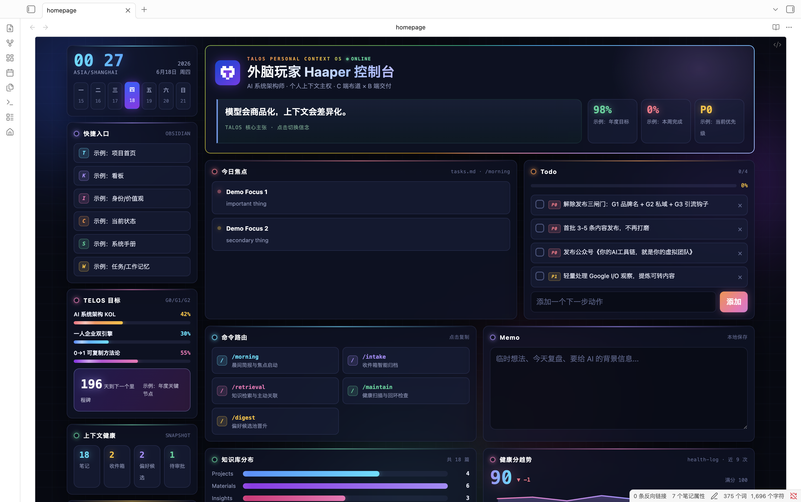
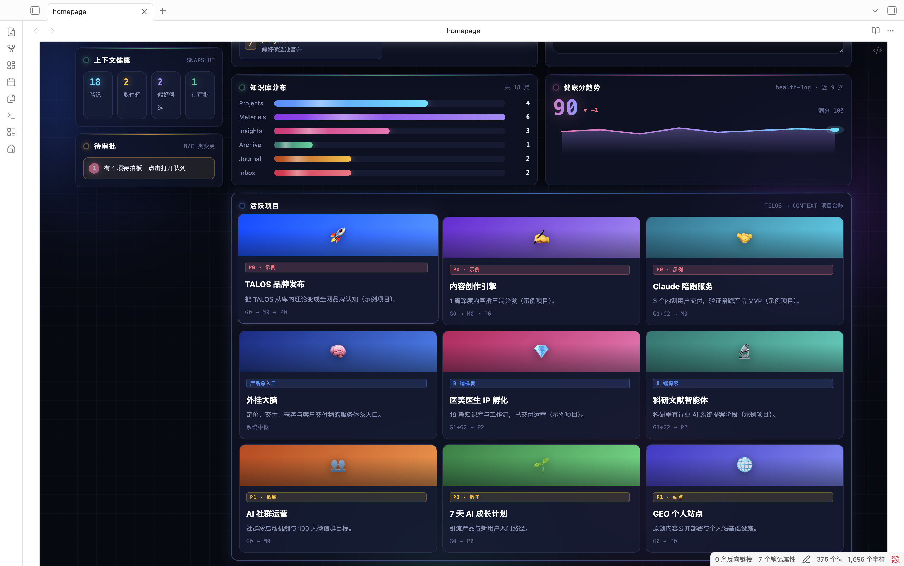
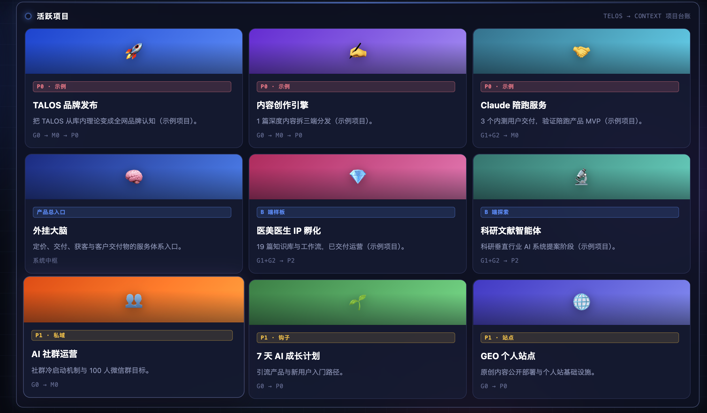
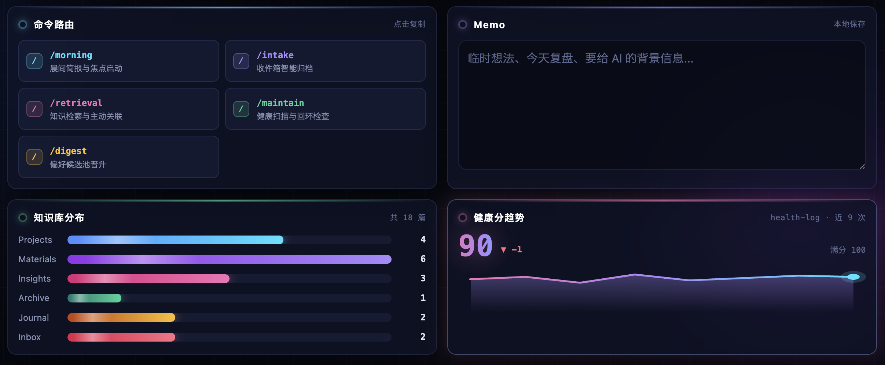
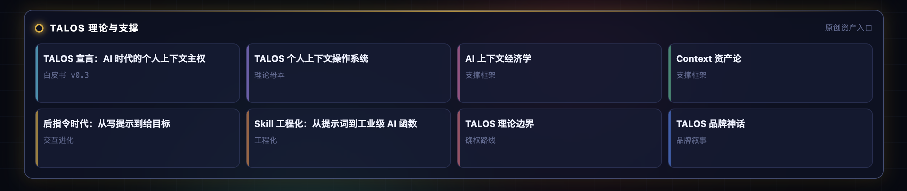

<div align="center">

# TALOS Dashboard

### 个人上下文操作系统的可视化控制台 · Obsidian 一页式工作台首页

<p>
  <a href="#-快速开始">快速开始</a> ·
  <a href="docs/CUSTOMIZE.md">自定义</a> ·
  <a href="docs/ARCHITECTURE.md">架构</a> ·
  <a href="docs/BUILD_TUTORIAL.md">构建教程</a> ·
  <a href="CHANGELOG.md">更新日志</a>
</p>



<p>
  
  
  
</p>

</div>

---

> **TALOS**（Talos Articulated Lattice of Operating Self）是 [外脑玩家 Haaper](https://github.com/外脑玩家) 提出的「个人上下文操作系统」理论框架——把一个人的目标、价值观、项目、笔记、决策、习惯结构化成可被任何 AI 调用的「上下文资产」。本项目是 TALOS 控制台的**官方开源实现**：一张 `dashboard.html` 把整套系统聚合为 Obsidian 启动首页。

## ✨ 特性

- **极光视觉** · 四色漂浮光球、Hero 彩虹流动描边、入场卡片上浮+数字滚动+进度条生长+折线描线动画、悬停微交互；纯 CSS/原生 JS 实现，离线可用，并自动支持 `prefers-reduced-motion` 降级。
- **Obsidian 集成** · 通过 Dataview JS + `iframe(srcdoc)` 内联，一张 HTML 始终是唯一可编辑源；卡片点击经 `postMessage` 桥接，在库内直达笔记（`.md` 新标签、`.html` 系统默认浏览器）。
- **数据动态化** · 自带 `refresh-dashboard.py` 扫描 vault，把笔记数、收件箱、待审批、偏好候选、健康分趋势、今日焦点写入 HTML 的 STATS 块；数字不再过时。
- **零依赖** · 无 npm、无 CDN、无第三方库；只需 Obsidian + Dataview + Homepage 两个社区插件。
- **完全可定制** · 全部内容（项目卡、命令路由、快捷入口、信念金句、理论入口、配色）都在 HTML 末尾的 `<script>` 数据数组里，改数组即生效。

## 🎬 Demo



<details>
<summary><b>📸 模块特写（点击展开）</b></summary>

| 模块 | 截图 |
|---|---|
| 侧栏 · 时钟 / 快速入口 / TELOS 目标 / 倒计时 |  |
| 活跃项目卡片网格 |  |
| 命令路由 + Memo |  |

</details>

> 动图 demo（入场动画 + 悬停弹跳）首版待补，规格见 [`screenshots/README.md`](screenshots/README.md)。

## 📦 快速开始

**前置**：Obsidian 桌面版 + 两个社区插件（Dataview、Homepage）。

```bash
git clone https://github.com/外脑玩家/talos-dashboard.git  # 中文 handle，浏览器/IDE 自动处理
cd talos-dashboard
```

把 `dashboard.html` / `homepage.md` / `talos-dashboard-home.css` 复制到你的 vault，安装插件，改 4 个 JSON，重启 Obsidian。详细 5 步部署见 **[docs/DEPLOYMENT.md](docs/DEPLOYMENT.md)**。

刷新数据：

```bash
python3 refresh-dashboard.py --vault /path/to/your/vault
```

## 🎨 自定义

- 改项目卡、命令路由、快捷入口、信念金句：编辑 `dashboard.html` 末尾的 `<script>` 数据数组。
- 改全局色板、区块主题色、极光背景、彩虹流动：编辑 `<style>` 内的 `:root` 变量与各 `<section>` 内联 `--ac`。
- 改 `refresh-dashboard.py` 扫描的目录与文件：编辑脚本顶部的「配置区」。

完整指南见 **[docs/CUSTOMIZE.md](docs/CUSTOMIZE.md)**。

## 🏗 架构

| 决策 | 为什么这么做 |
|---|---|
| HTML 用 `dataviewjs` + `iframe.srcdoc` 内联 | Obsidian 阅读视图过滤 `<script>`，但 dataviewjs 用 DOM 注入的 iframe 不受过滤 |
| 卡片点击用 `postMessage` 桥接 | iframe 内跳转自定义协议不稳定；桥接后 `.md` → `openLinkText(tab)`，`.html` → `openWithDefaultApp` |
| 用 CSS 片段去外壳 + 击穿「可读行宽」 | 让 iframe 像 App 一样整页铺满，而不是被笔记主题压窄 |
| 数据用静态 STATS 块 + Python 扫描器 | iframe 内脚本无法实时读 vault 里的 `.md`，扫描器按需重生成即可 |

详见 **[docs/ARCHITECTURE.md](docs/ARCHITECTURE.md)**。

## 📖 构建教程

「我是怎么从零造出这张仪表盘的」——三个关键工程问题的解法、视觉系统的设计逻辑、关键代码段解读、二次开发建议。

详见 **[docs/BUILD_TUTORIAL.md](docs/BUILD_TUTORIAL.md)**。

## 🙏 致谢

- 视觉与「一页式工作台」形态启发自 **[Apex Dashboard](https://github.com/PandoraReads/apex-dashboard)** by PandoraReads。
- 信念金句与项目叙事来自 **TALOS** 个人上下文操作系统理论框架。

## 📄 License

代码以 **[AGPL-3.0](LICENSE)** 开源。

> 「TALOS」是外脑玩家 Haaper 的个人品牌名，本项目代码 AGPL-3.0 开源，但「TALOS」品牌名本身不随代码授权。你可以在自己的 vault 内自由使用，但对外公开分发或商业用途请改名。

## 👤 作者

**外脑玩家 Haaper** · AI 系统架构师 · 个人上下文主权布道者

- 公众号：**外脑玩家**（搜「外脑玩家」关注）
- X / Twitter：[@Haaper外脑玩家](https://x.com/Haaper外脑玩家)
- GitHub：[@外脑玩家](https://github.com/外脑玩家)
- 网站：待上线

---

<div align="center">

如果这张仪表盘启发了你，欢迎 star ⭐ / 分享 / 提 issue。

</div>
