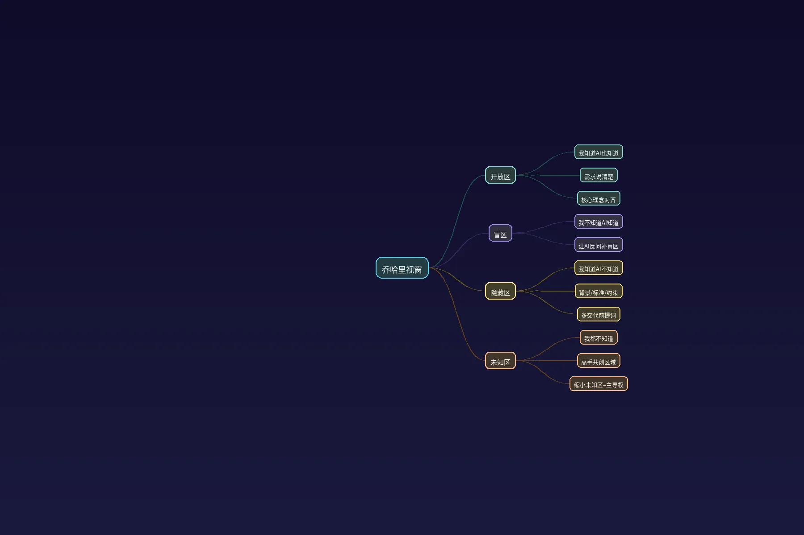

# Ai 高级用法：乔哈里视窗

> 📺 [视频链接](https://v.douyin.com/qycowgeHkLI/) | 👤 作者：Ai一刀梁山伯 | ⏱ 时长：4分01秒

***

## 一、核心论点总结

**乔哈里视窗是掌握AI协作的底层密码。** 通过分析"我知道/AI知道"的信息对齐程度，将人机协作划分为四个象限——开放区、盲区、隐藏区、未知区。核心策略是不断扩大开放区（把背景、标准、约束充分告诉AI，同时让AI帮你补上盲区），让AI从泛泛而谈变成真正靠谱的军师。

**用不好AI的根本原因是信息不对齐。** 盲区大的人指令多但从不向AI请教自己不懂的领域；隐藏区大的人只丢一句话不给任何背景。两种情况都会导致AI答非所问或给出泛泛而谈的结果。解决方法就是主动扩大开放区——多交代背景、多让AI反问。

**进阶版：缩小未知区，实现认知升级。** 未知区是人和AI都没想到的可能性，高手与AI共创的关键就在这个区域。通过抛出模糊方向、反复迭代沟通，不断突破认知边界，缩小未知区，从而获得对人机协作的主导权。

**主导权意味着灵活调节开放区的尺度。** 想让AI快速出活就收窄开放区把活交出去；想跟AI深挖问题就扩大开放区把信息全部摊开。这种主动调节的能力让人从"被工具牵着走"变成"自由驾驭AI"。

**用AI不仅是追求效率，更是扩展认知、守住独立思考。** 真正的高手追求的是在AI领域里始终拥有主动调节的尺度和独立的主导权，让AI成为越来越懂自己的外脑，而不是一味追求效率被迫接受敷衍的答案。

***

## 二、思考问题

1. **在你的日常工作场景中，你的"隐藏区"和"盲区"分别有多大？** 回忆一次AI给你泛泛而谈的经历，分析是因为你没交代清楚背景（隐藏区大），还是你压根不知道该问什么（盲区大）？
2. **如何设计一个"与AI缩小未知区"的迭代流程？** 比如面对一个全新的项目方向，你会如何通过多轮对话把未知区里的可能性逐步挖掘出来？具体的第一步、第二步分别是什么？
3. **"对AI保持主导权"和"追求AI效率最大化"之间是否存在矛盾？** 当你把开放区收窄让AI快速出活时，是否也在放弃认知升级的机会？如何在日常使用中平衡"出活效率"和"认知扩展"这两个目标？

***

## 三、思维脑图

***

***

## 四、视频逐字稿

今天我要分享一个特别厉害的用AI的方法，叫乔哈里视窗。当你熟练掌握并运用这个方法的时候，你就完全掌握了用好AI的底层密码。同时我也跟你分享这个方法的进阶版本，是我自己的独家秘方。

***

乔哈里视窗说的是，关于手上这件事的信息，我们可以通过调整信息的对齐程度，去决定我们跟AI能干出什么样的活。

关于这件事的信息，有我知道的和我不知道的，AI知道的以及AI不知道的。

***

我知道AI也知道的叫开放区。比如说我们把需求说清楚了，AI也能接住了，我的核心想要表达的理念它也懂了，这个就属于我们的开放区。

***

我不知道但AI知道这个叫盲区。比如说一个领域有很多更深的门道，你压根不知道该怎么去问，但AI其实全都知道，只是你没有挖掘出来，这个就是你的盲区。

***

还有我知道AI不知道的这个叫隐藏区。这个隐藏指的是你脑子里的背景、你的标准、你的约束、那些你觉得这还有说不太出口的前提词，这个叫隐藏区。

***

还有我不知道AI也不知道的，就是未知区。那些全新的还没被想到的可能性都在这个区域。

***

当你知道这个模型，怎么让AI变成一个更听话、更靠谱真正帮你出活的高级助手，就是扩大自己的开放区。把脑子里的前提词全倒给它，多让AI反过来提醒你，补上你的盲区把这个部分接住，多问多说你的开放区就会扩大。

当你的开放区足够大的时候，AI在你手里就是那个聪明的、靠谱的军师。这个就是用好AI的秘密，没有别的。

***

你知道很多人为什么用不好AI吗？他看起来指令下得挺多的，但是AI总是答非所问。那的人就是盲区特别大的人，他指令下得多，但从来不问AI自己不懂的，这样的人用AI也弄不出什么名堂。

有一些人只是丢给AI一句话，啥背景都不交代，那这样的人他的隐藏区就特别的大，这样的人会得到一种AI完全猜不透他要干嘛，给出来的全是泛泛而谈根本没用的结果。

所以你想要用好AI很简单，扩大你的开放区。

***

接下来我就要分享一个进阶版本，关于认知升级的。大家有没有发现，刚刚我讲的这个过程，讲了三个区，那未知区怎么用？就是你和AI都还没想到的可能性，那些还没被挖掘出来的底层的新东西，这个就是真正高手跟AI共创的区域。

***

一个人跟AI的未知区特别大的时候，他大部分的可能性都还没被挖出来，这样的人用AI会有什么感觉？会有一种其实也天天在用呀，你也挑不出他哪里用错了，但就是用得平平无奇，这个人就会觉得AI也就那样，没啥了不起的。这就是他和AI都不知道的板块太多了。

那我们真正的认知升级要去到地方，就是不断缩小这个区域，让你跟AI一起把那些没想到的东西一点点挖出来。当这个区域变小的时候，你就是一个有主导权的人。

***

比如抛一个模糊的方向，跟AI反复的迭代沟通，更加深入地突破你自己的认知边界。当你的未知区域越小，你跟AI的协作就非常大的想象空间。

比如说当你只想让AI快点出个结果，你就主动把开放区收窄把活交出去。当想跟AI一起深挖一个问题，你就扩大你的开放区，把信息全部摊开。这个尺寸由你自己来调节，你就会变成一个非常灵活、非常自由地驾驭AI的人，而不是一味地追求那一点点的效率被工具牵着走，被迫接受AI敷衍你的答案。

***

你跟AI的协作就有了主导权。所以乔哈里视窗给了我们一个视角，我们真正去进行好跟AI的这扇窗，缩小你和AI的未知区，你跟AI的关系就会越来越好。当你跟AI的关系非常好，它就越来越懂你，越来越像你的外脑。你在做事这个层面就有了非常多的选择。

***

你想要AI帮你出活的时候，你就扩大你的开放区。你想要自己安静地想清楚的时候，你就把方向攥在自己手里收窄你的开放区。你做事和用AI都会变得非常自由。

我为什么会有这个进阶版本的运用呢？是因为我用AI的观念，不仅仅是追求干活上的那些效率，同时我还追求用AI扩展自己的认知，守住独立思考的空间。所以我更在乎我怎么始终对AI保持主导权，在给AI的领域里有主动调节的尺度和独立的主导权。就是这个模型进阶版本的运用意义。

***

> 本文档由 video-transcript Skill 自动生成
> 转录引擎：Whisper
> 总结生成：手动整理

---

## 双链笔记

- [[ai知识库/# AI 短剧爆发？我亲测了下！【小云雀 2.0 实测】]]
- [[ai知识库/# Obsidian 10 大 Skill 盘点，你用过吗？]]
- [[ai知识库/# OpenClaw, Hermes, Codex 横向评测]]
- [[ai知识库/# 企业 AI 落地最优单元｜AI 时代护城河]]
- [[ai知识库/# 几分钟教你远控家里 Mac 上的 AI Agents]]
